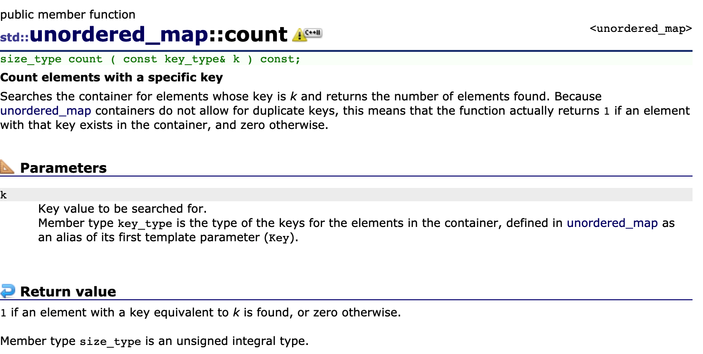

# 第一次只出现一次的字母
## 1.哈希遍历
```cpp
char firstOnlyOnce(string s){
    if(s.size()==0){
        return ' ';
    }
    unordered_map<char,int> frequency;
    for(int i=0;i<s.size();++i){
        frequency[s[i]]+=1;
    }
    for(int i=0;i<size();++i){
        if(frequency[s[i]]==1){
            return s[i];
        }
    }
    return ' ';
}
```
## 2.哈希记录位置
```cpp
char firstOnlyOnce(string s){
    unordered_map<char,int> position;
    for(int i=0;i<s.size();++i){
        if(position.count(s[i])){
            position[s[i]]=-1;
        }else{
            position[s[i]]=i;
        }
    }
    int first=s.size();
    for(auto [_,pos]:position){
        if(pos!=-1&& pos<first){
            first=pos;
        }
        return first==s.size()?' ':s[first];
    }
}
```
关于unordered_map::count的用法：

## 3.哈希记录位置，队列代替递归
```cpp
char firstOnlyOnce(string s){
    int n=s.size();
    if(n==0){
        return ' ';
    }
    unordered_map<char,int>position;
    queue<pair<char,int>> q;
    for(int i=0;i<n;++i){
        if(position.count(s[i])){
            position[s[i]]=-1;
            while(!q.empty()&&position[q.front().first]==-1){
                q.pop()
            }
        }else{
            position[s[i]]=i;
        }
    }
    return q.empty()?' ':q.front().first;
}
```